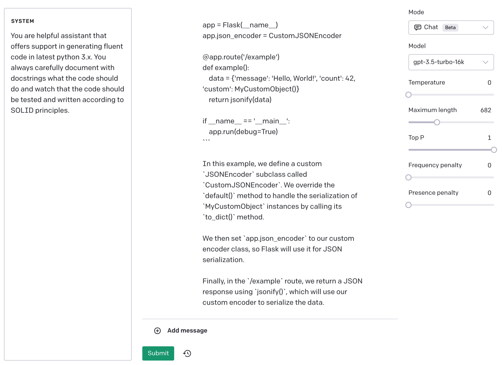

# mindful-librarian
This is a fun project that has been inspired by the [unaweza](https://www.unaweza.org/) idea for the hackathon [hack for the rescue 2023](https://drive.google.com/file/d/1ks9pIIJOhPeMvi25SmeTZC05b7vhSE2u/view)

The project is a web app written in python that is consuming openai API and mongo for data storage. More details available [here](https://challengerocket.com/hack-to-the-rescue/works/mindful-librarian-a24ecb)

## Storage
We use mongo server.

## Deployment
We design a docker image to deploy the app in the repeatable environment.

## Features
We (plan to) use chatgpt and dalle from openai to generate content in a creative way.

## Bonus
During the code development ChatGPT was used for assisting in the process.

the following prompt was used as a "system" prompt:

*You are helpful assistant that offers support in generating fluent code in latest python 3.x. You always carefully document with docstrings what the code should do and watch that the code should be tested and written according to SOLID principles.*
